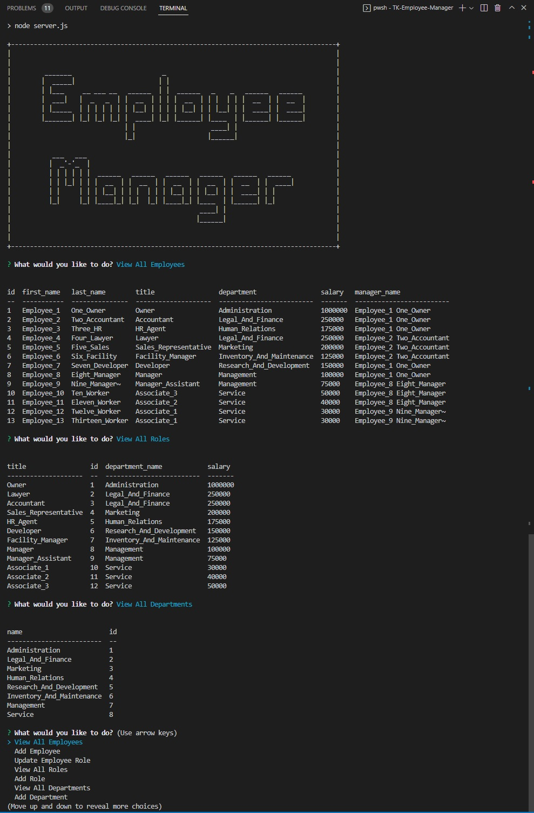

# Bootcamp Module 12 Challenge Assignment -- An "Employee Database Manager" Application

## Description

This current Module 12 Challenge assignment -- an "Employee Database Manager" -- is a console-based application that allows for employee data that is contained in the application MySQL2 database to be managed/referenced/updated -- by "Add a New Item" and "View All Items" functions (main menu items) -- by a manager of the involved company. The functional/usage details of the application are described at below. The assignment provided a good mechanism for learning introductory fully-functional database-based application programming; with much consideration about the various elements of function/data flow to the database and then the related corresponding resultant actions of the application with the response data; also with an introduction to the concept and process of data security/authentication.

The assignment also provided good opportunity for considering about the implementation necessities of additional (bonus grade points) related features (main menu items) that would add good additional functionality to the application...such as "Update employee managers" and "View employees by manager" and "View employees by department" and "Delete departments, roles, and employees" and "View the total utilized budget of a department—in other words, the combined salaries of all employees in that department" (by using database aggregate functions); but unfortunately the involved student programmer ran-out of programming time and had to start on the next assignment.

----

The objectives -- user story and acceptance criteria items -- of the assignment were as follows:

[ User Story ]

User Story
AS A business owner...

I WANT to be able to view and manage the departments, roles, and employees in my company...
SO THAT I can organize and plan my business

[ Acceptance Criteria ]

GIVEN a command-line application that accepts user input...

WHEN I start the application...
THEN I am presented with the following options: view all departments, view all roles, view all employees, add a department, add a role, add an employee, and update an employee role.

WHEN I choose to view all departments...
THEN I am presented with a formatted table showing department names and department ids.

WHEN I choose to view all roles...
THEN I am presented with the job title, role id, the department that role belongs to, and the salary for that role.

WHEN I choose to view all employees...
THEN I am presented with a formatted table showing employee data, including employee ids, first names, last names, job titles, departments, salaries, and managers that the employees report to.

WHEN I choose to add a department...
THEN I am prompted to enter the name of the department and that department is added to the database.

WHEN I choose to add a role...
THEN I am prompted to enter the name, salary, and department for the role and that role is added to the database.

WHEN I choose to add an employee...
THEN I am prompted to enter the employee’s first name, last name, role, and manager, and that employee is added to the database.

WHEN I choose to update an employee role...
THEN I am prompted to select an employee to update and their new role and this information is updated in the database.

[ Additional Grading Criteria ]

Also good coding practices and good GitHub/Git repository configuration.

## Installation

Make sure that you have a GitHub membership and account to be able to view the repository of the assignment webpage system. The published GitHub Pages view of the website should be accessible on the public internet access URL without a need to have a GitHub membership/account.

** IMPORTANT **

If the repository is being cloned to a local user computer for separate review/grading/usage...then use the "npm i" command from the console of the local clone directory. That command will trigger the auto-install process for all of the imported 3rd-party module programs that are required for the "Employee Database Manager" application to be able to run. One of the module programs that is installed/required is the "MySQL2" database program...which is used to contain the data that the "Employee Database Manager" application uses. After the installation of the "MySQL2" database program...there is an additional requirement of the following manual installation steps that will require the database user name and authentication information items that are contained within the main application server file:

1) Load/Source the application database and its data table structures by entering the command "source schema.sql;" at a MySQL2 command prompt (when logged-in to that system) when the main file system location of the computer and the console window is in the clone database of the "Employee Database Manager" application.

2) Load/Seed the example data of the application database by entering the command "source seed.sql;" at a MySQL2 command prompt (when logged-in to that system) when the main file system location of the computer and the console window is in the clone database of the "Employee Database Manager" application.

## Usage

To use this application/webpage...at after when installing the application and its database and then using the "node server" command or the "npm run" command to start the application...

1. Click the menu items and view the displayed information and respond to it as-necessary.

2. Add some new records.

3. View the new records that are added.

4. Update some existing records.

5. View the records that are updated.

The following picture shows the console-based appearance of the Employee Database Manager application:

### APPLICATION DEMONSTRATION VIDEO

The following URL is for the GitHub Pages published static-view public view of Todd Kridel's Coding Bootcamp Module 12 Challenge assignment...which contains an embedded display frame that is for the demonstration video of the application...and indicates a link that goes back to this README description file of the application: "https://todd-kridel.github.io/TK-Employee-Manager/".

## Credits

Special mention to my persistence.

## License

MIT License

Copyright (c) 2022 DU Full-Stack Web Development Coding Boot Camp

Permission is hereby granted, free of charge, to any person obtaining a copy
of this software and associated documentation files (the "Software"), to deal
in the Software without restriction, including without limitation the rights
to use, copy, modify, merge, publish, distribute, sublicense, and/or sell
copies of the Software, and to permit persons to whom the Software is
furnished to do so, subject to the following conditions:

The above copyright notice and this permission notice shall be included in all
copies or substantial portions of the Software.

THE SOFTWARE IS PROVIDED "AS IS", WITHOUT WARRANTY OF ANY KIND, EXPRESS OR
IMPLIED, INCLUDING BUT NOT LIMITED TO THE WARRANTIES OF MERCHANTABILITY,
FITNESS FOR A PARTICULAR PURPOSE AND NONINFRINGEMENT. IN NO EVENT SHALL THE
AUTHORS OR COPYRIGHT HOLDERS BE LIABLE FOR ANY CLAIM, DAMAGES OR OTHER
LIABILITY, WHETHER IN AN ACTION OF CONTRACT, TORT OR OTHERWISE, ARISING FROM,
OUT OF OR IN CONNECTION WITH THE SOFTWARE OR THE USE OR OTHER DEALINGS IN THE
SOFTWARE.

